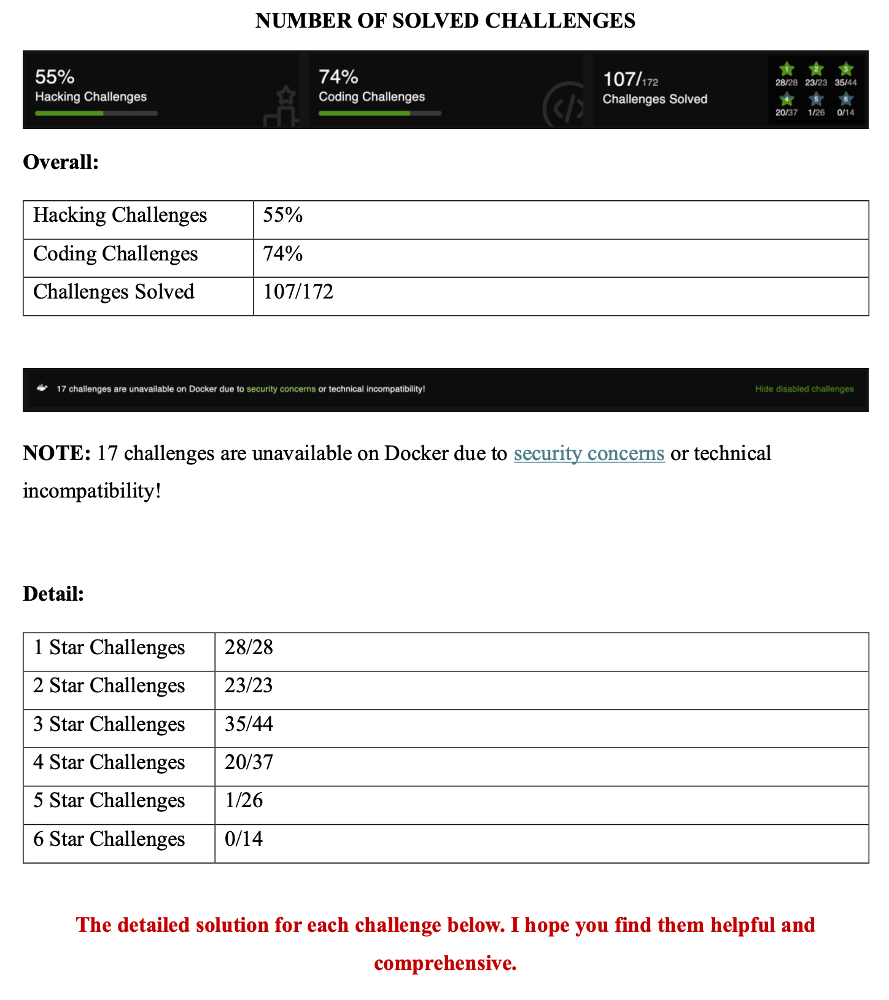

# OWASP Juice Shop Security Analysis & Handbook

## About The Project

This repository documents a comprehensive security research and penetration testing process on **OWASP Juice Shop**, the most modern and sophisticated insecure web application. The project focuses on identifying, exploiting, and providing remediation for a wide range of web vulnerabilities, from broken access control to complex injection flaws.

Currently, the project is being transformed into a searchable, interactive web handbook. 

> [!IMPORTANT]  
> **Current Status:** The web-based version of this handbook is **under construction**. For the full, finalized, and detailed report (covering 100+ challenges), please refer to the PDF version:
> # **[OWASP Juice Shop Handbook.pdf](./OWASP-Juice-Shop-Handbook.pdf)**.
> 

### Key Features (Detailed in PDF)
* **Comprehensive Coverage:** Detailed solutions for **107 out of 172 challenges**, ranging from 1-star to 5-star difficulty levels.
* **Vulnerability Mapping:** Attacks are categorized based on the OWASP Top 10, including SQL Injection, XSS, Broken Authentication, and Security Misconfigurations.
* **Deep-Dive Analysis:** Each challenge includes a technical explanation of *why* it is vulnerable and *how* to implement a secure fix.
* **Modern Documentation:** Transitioning to an **MkDocs** environment to provide a better UI/UX for reading security write-ups.

---

## Handbook Architecture & Design

The handbook is structured to follow the learning curve of a security researcher, moving from basic client-side bypasses to complex server-side exploitation.

### Project Components
1. **Full Technical Report (Final):** `OWASP Juice Shop Handbook.pdf` – Contains the complete methodology and final results.
2. **Web Handbook (WIP):** Built using **MkDocs** and the **Material theme** for a high-quality documentation experience.
3. **Vulnerability Assets:** A structured collection of screenshots and payloads used during the penetration testing process.

---

## Implementation Details

### Vulnerability Categories
The research focuses on several key areas of web security:
* **Injection:** Bypassing login forms and extracting database information.
* **Sensitive Data Exposure:** Finding hidden backup files and administrative credentials.
* **Broken Access Control:** Escalating privileges from a standard customer to an administrator.
* **Cross-Site Scripting (XSS):** Executing malicious scripts in the context of other users' sessions.

### Security Deep-Dives
Beyond just "hacking," the project emphasizes remediation. Each write-up includes:
1. **Exploitation:** Step-by-step guide using tools like Burp Suite and SQLmap.
2. **Root Cause Analysis:** Analyzing the insecure code responsible for the flaw.
3. **Prevention:** Code-level recommendations to mitigate the risk.

---

## Progress Summary
The following table summarizes the challenges completed in the finalized PDF report:

| Difficulty | Solved / Total | Status |
| :--- | :--- | :--- |
| ⭐ (1 Star) | 28/28 | Completed |
| ⭐⭐ (2 Stars) | 23/23 | Completed |
| ⭐⭐⭐ (3 Stars) | 35/44 | On-going |
| ⭐⭐⭐⭐ (4 Stars) | 20/37 | On-going |
| ⭐⭐⭐⭐⭐ (5 Stars) | 1/26 | On-going |

---

## Tech Stack
* **Documentation:** Markdown, MkDocs (Material Theme).
* **Security Tools:** Charles Proxy, SQLmap, CyberChef.
* **Environment:** Docker (for hosting OWASP Juice Shop).
* **Target:** Node.js, Express, and Angular based architecture.
