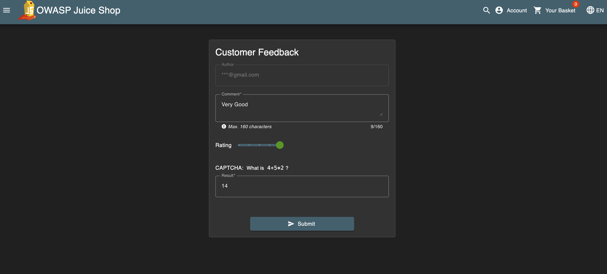
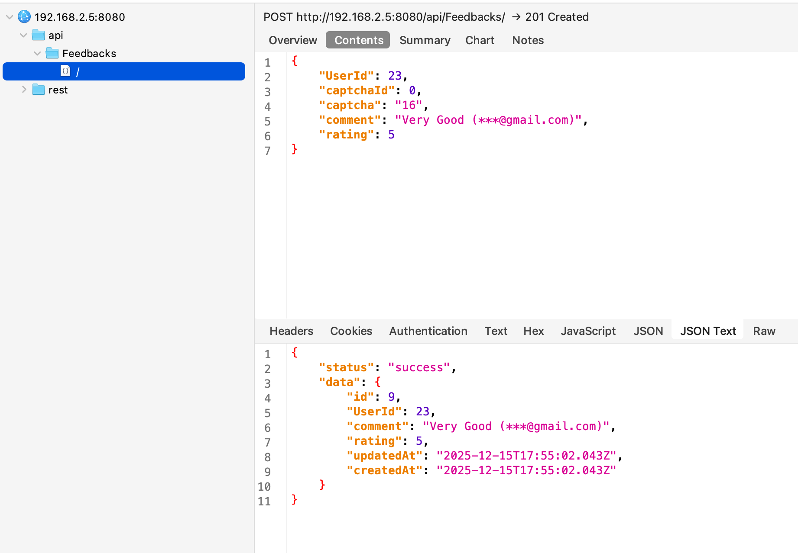
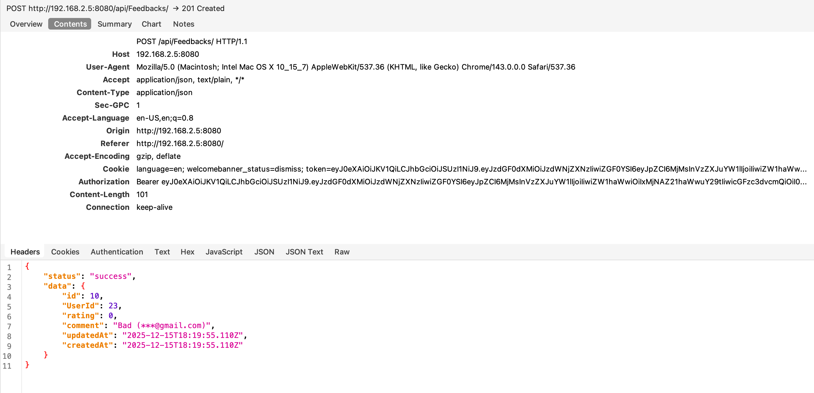
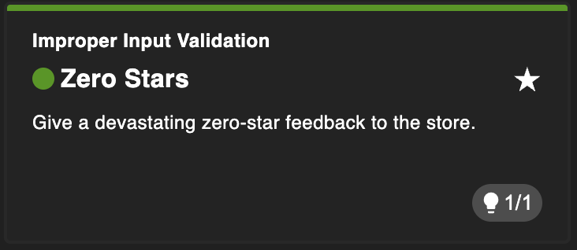

# Zero Stars
## Why this challenge?

The goal is to submit a product review with a rating of zero stars. This challenge demonstrates an Improper Input Validation vulnerability where the application relies on client-side controls (disabling the submit button) to enforce business rules, without verifying the data on the server-side.

## How did I analyze?

* Observation: When writing a review, the "Submit" button remains disabled until I select at least one star. The UI forces a rating between 1 and 5.

* Hypothesis: The restriction might only be implemented in the frontend (HTML/JavaScript). If I can bypass the UI restriction or modify the network request directly, the backend might accept a rating of 0 (or no rating at all) if it doesn't validate the input range properly.

## What did I do?

I used two different methods to solve this challenge.

### Step 1
Intercepting and Modifying Network Requests (Charles Proxy)

### Step 2
I selected 1 star and clicked "Submit" on the review form.


### Step 3
Intercept: I paused the request in Charles Proxy.


```http request
{
	"status": "success",
	"data": {
		"id": 9,
		"UserId": 23,
		"comment": "Very Good (***@gmail.com)",
		"rating": 5,
		"updatedAt": "2025-12-15T17:55:02.043Z",
		"createdAt": "2025-12-15T17:55:02.043Z"
	}
}
```

### Step 4
Modify: I changed the rating parameter from 1 to 0.
```json
{
	"captcha": "16",
	"UserId": 23,
	"rating": 0,
	"comment": "Bad (***@gmail.com)",
	"captchaId": 0
}
```

### Step 5
Forward: I sent the modified request to the server. The server accepted it with a 200 OK response.


## Completed challenge!


## Why is it vulnerable?

* Client-Side Trust: The application trusted the browser to enforce the "rating must be >= 1" rule.

* Missing Server Validation: The server-side API received the data (rating: 0) and processed it without checking if the value was within the valid range (1-5).

## How to prevent it?

* Server-Side Validation: Always validate input on the server. The API should reject any feedback with a rating less than 1 or greater than 5 with a 400 Bad Request error.

* Data Type Checks: Ensure the rating is an integer and strictly strictly conforms to the expected range constraints before saving to the database.

## What did I learn?

* Client-side controls are not security: Disabling a button or hiding an element in HTML does not prevent an attacker from sending malicious data.

* Input Validation: Every piece of data coming from the user (even dropdowns or star ratings) must be treated as untrusted.