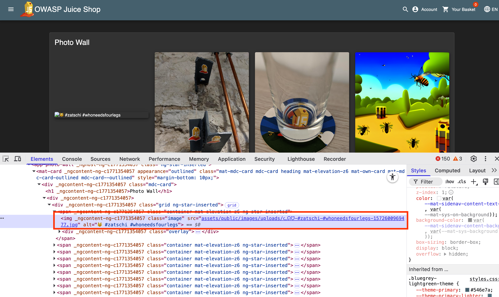
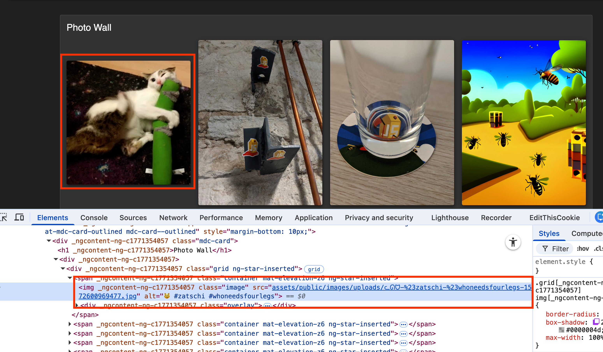
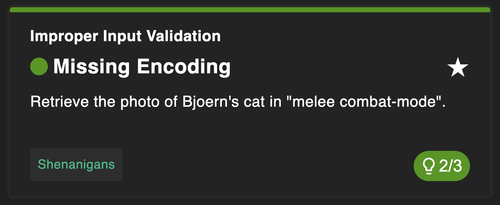

# Missing Encoding

## Why this challenge?

The goal of this challenge is to retrieve an image that fails to load on the website. This highlights the importance of URL Encoding. Web browsers interpret specific characters (like # or ?) as control characters. If a filename contains these characters but isn't properly encoded, the browser will request the wrong resource.

## How did I analyze?

- **Observation**: On the "Photo Wall" page, I noticed a broken image icon.

- **Hypothesis**: When I inspected the element, I saw the src attribute contained special characters, specifically hashtags `#` and emojis `🙀`.

- **The Problem**: In a URL, the `#` character indicates the start of a "fragment identifier" (like an anchor). The browser stops reading the file path at the first # and treats the rest as a client-side navigation marker. Therefore, the server never receives the full filename request.

## What did I do?

### Step 1

I inspected the broken image using Developer Tools. I saw the source URL:
`assets/public/images/uploads/ᓚᘏᗢ-#zatschi-#whoneedsfourlegs-1572600969477.jpg`

### Step 2

`#` ==> `%23`
I used an online URL encoder (or simply modified the URL logic in my head) to construct the valid path.
Encoded Path:
`assets/public/images/uploads/ᓚᘏᗢ-%23zatschi-%23whoneedsfourlegs-1572600969477.jpg`

### Step 3

I navigated directly to this encoded URL paste to replace the original one. After that you can see the picture.

## Complete Challenge

## Why is it vulnerable?

- **Improper Input Validation**: The application allowed users to upload files with special characters in their names but failed to rename them or encode them properly when referencing them in the HTML.

- **Broken Reference**: Because the URL wasn't encoded, the browser parsed it incorrectly, breaking the application's functionality (the image didn't load).

## How to prevent it?

- **URL Encoding**: Always URL-encode dynamic data (like filenames) before inserting them into HTML attributes (href, src). In JavaScript, use encodeURIComponent().

- **Sanitize Filenames**: When saving uploaded files, rename them to safe, alphanumeric strings (e.g., image_12345.jpg) or strip out special characters to avoid these parsing issues entirely.

## What did I learn?

- **Browser Parsing:** Browsers have strict rules for interpreting URLs. Characters like #, ?, /, and & have special meanings and must be encoded (%23, %3F, etc.) if they are part of the data.

- **Emoji Handling**: Even modern characters like emojis are just bytes that need to be encoded to travel safely across the web.
