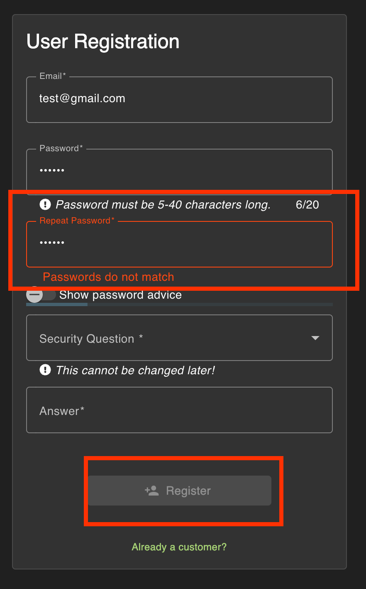
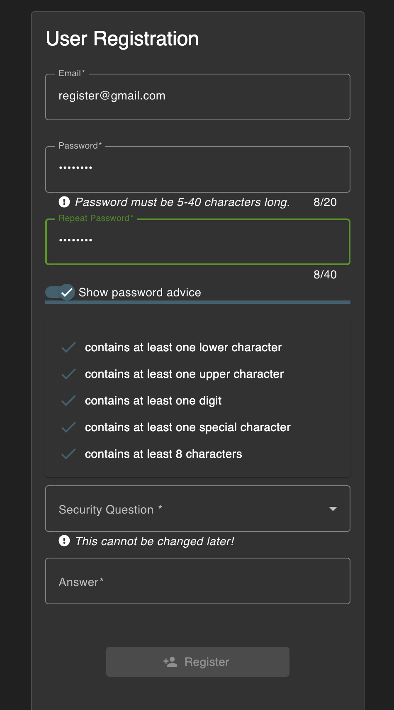
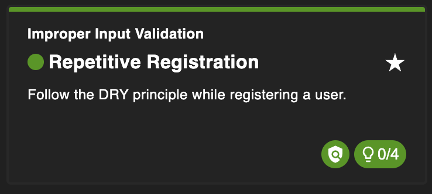

# Repetitive Registration

## Why this challenge?

The goal is to register a user with inconsistent passwords. This challenge explores Improper Input Validation, specifically how relying solely on client-side checks (like disabling a button or showing validation colors) is insufficient if the server doesn't enforce the same rules.

## How did I analyze?

* Observation: The registration form requires users to enter their password twice. The UI provides visual feedback (green/red) and disables the "Register" button if the passwords do not match.
  
* Hypothesis: The validation logic likely runs only on the input or change event. If I can trick the UI into thinking the passwords match initially, and then change one field without triggering the validation check again (or if the check is flawed), I might be able to submit mismatching data.

## What did I do?

### Step 1

I filled out the registration form with a valid email and security question.
For the password fields, I initially entered two identical passwords (e.g., 12345 and 12345).
The UI showed a green checkmark (or similar indicator), and the "Register" button became enabled.

### Step 2
I went back to the first "Password" field and changed it to something else (e.g., abcde), while leaving the "Repeat Password" field as 12345.

### Step 3
Submit

## Completed challenge!

## Why is it vulnerable?

* Client-Side Flaw: The JavaScript validation might only check for consistency when the "Repeat Password" field is modified, but fails to re-validate when the original "Password" field is changed afterwards.

* Missing Server-Side Logic: The backend API endpoint for user registration accepted the payload without verifying that the password and passwordRepeat fields matched.

## How to prevent it?

* Server-Side Validation: The server must always validate that the two password fields match before creating the account.

* Robust Client Logic: Ensure validation runs on any change to either password field. However, never rely solely on client-side checks.

What did I learn?

UI States can be tricked: Just because a form looks "valid" (green checkmarks) doesn't mean the data inside is actually consistent if the logic has edge cases.

Server-side is King: The ultimate truth is validated on the server. If the server doesn't care about matching passwords, no amount of frontend JavaScript matters.