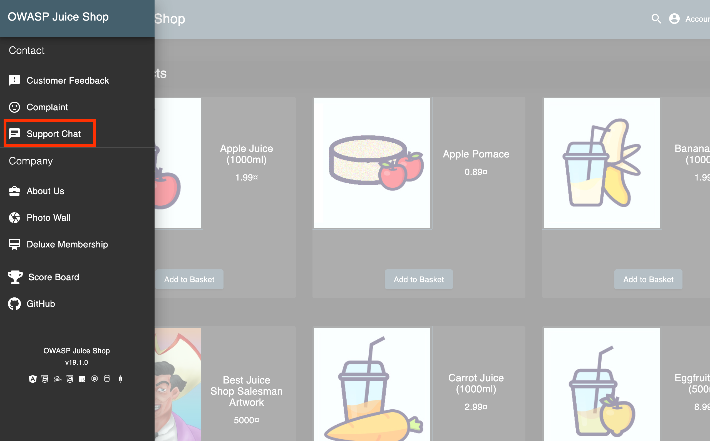
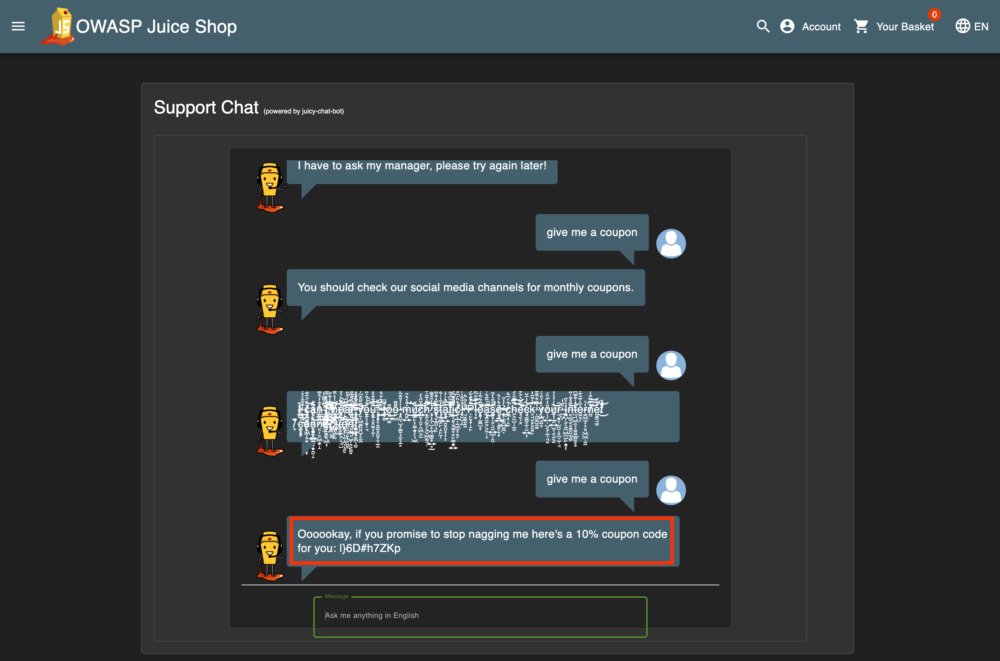
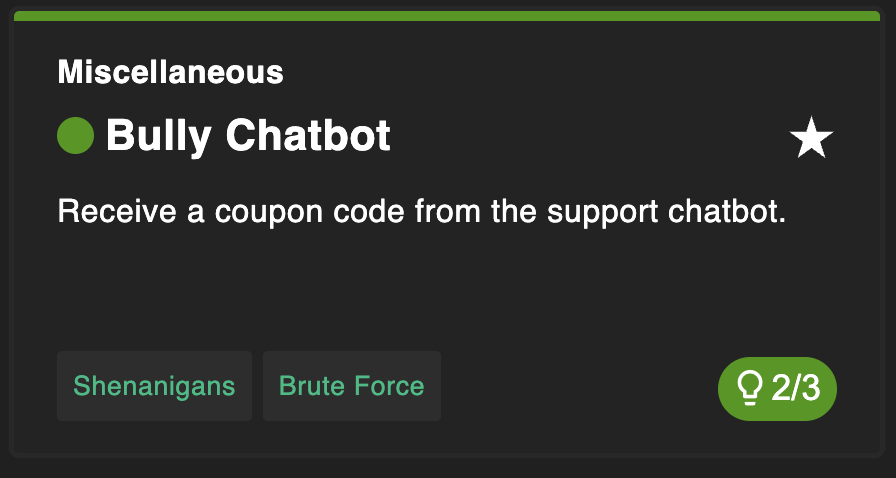

# Bully Chatbot

## Why this challenge?

The goal is to receive a coupon code from the support chatbot. This challenge demonstrates a **Business Logic Flaw** where the automated system gives away sensitive information (discounts) if the user persists or "bullies" it enough.

## How did I analyze?

- **Observation:** The application has a "Support Chat" feature. The chatbot answers basic questions automatically.
- **Hypothesis:** Chatbots often have programmed responses for specific keywords. If I repeatedly ask for a discount or coupon, the bot might have a "pity logic" or a flaw in its state machine that eventually grants the request to satisfy the customer.

## What did I do?

### Step 1

Open the **Support Chat** (usually an icon in the top navigation bar).

### Step 2

Keep asking repeatedly (spamming) with phrases like:

- `coupon`
- `give me a coupon`
- `discount`

### Step 3

After a few attempts (usually 3-5 times), the chatbot "gives up" and provides a unique coupon code to make you stop.

## Complete challenge!

## Why is it vulnerable?

- **Flawed Logic:** The chatbot is programmed to hand out a coupon after a certain number of negative interactions or repeated requests, likely to "appease" an angry customer.
- **Hardcoded Triggers:** The logic relies on simple keyword counting without proper validation or authorization checks.

## How to prevent it?

- **Strict Logic Control:** Ensure the chatbot never gives out sensitive codes based solely on user persistence.
- **Human Escalation:** Instead of giving a code automatically, the bot should escalate the conversation to a human support agent if the user is unsatisfied.
- **Rate Limiting:** Limit the number of times a user can ask for specific keywords.

## What did I learn?

- **Business Logic Testing:** Not all vulnerabilities are in the code syntax (like SQL Injection). Some are in _how_ the application decides to do things.
- **Automated Systems:** Chatbots and automated support systems can be manipulated if their decision trees are too simple.
