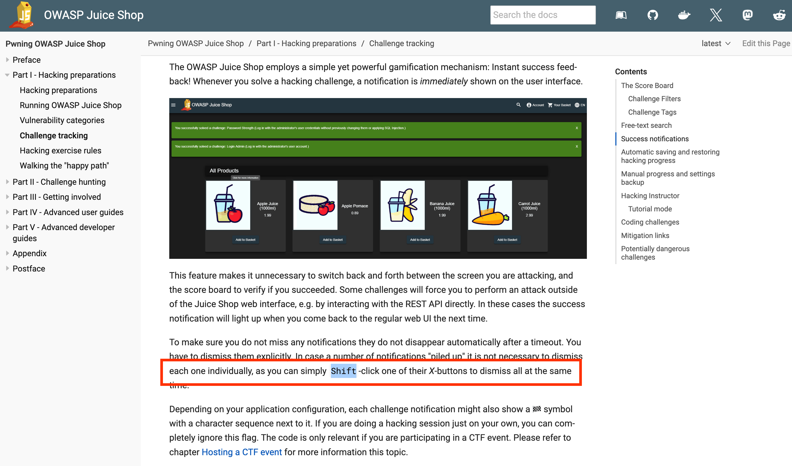
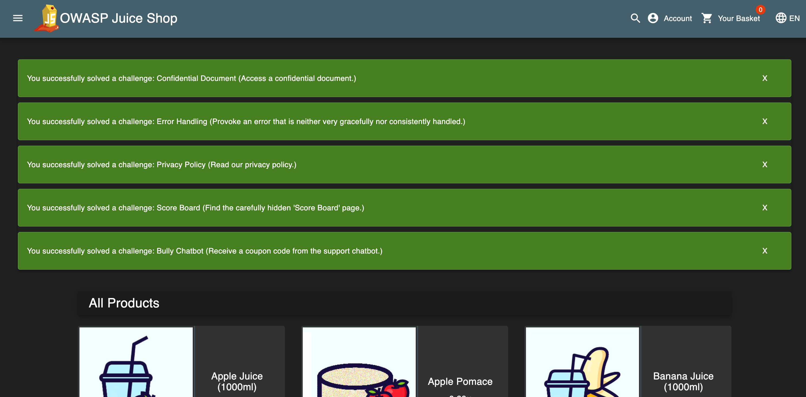
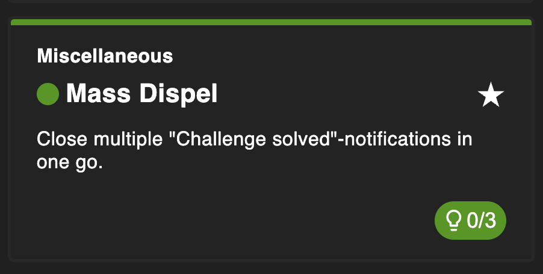

# Mass Dispel

## Why this challenge?

The goal is to close multiple "Challenge Solved" notifications at once. This challenge tests the ability to navigate the application efficiently and emphasizes the importance of reading the official documentation (RTFM - Read The Field Manual).

## How did I analyze?

- **Observation:** When solving multiple challenges quickly, the "Challenge Solved" notifications pile up on the screen, blocking the view. Closing them one by one is tedious.
- **Hypothesis:** Most complex web applications have keyboard shortcuts or "power user" features. The **OWASP Juice Shop Companion Guide** likely contains instructions on how to handle the UI efficiently.

## What did I do?

### Step 1

I visited the official [OWASP Juice Shop Companion Guide](https://pwning.owasp-juice.shop/companion-guide/latest/part1/challenges.html) to look for UI tips.

### Step 2

I found a section mentioning that holding the `Shift` key while clicking the "X" on a notification will close **all** currently visible notifications.

### Step 3

I held the `Shift` key and clicked the "X" button on one of the toast notifications.

### Proof of Concept

All notifications disappeared instantly, and the "Mass Dispel" challenge was marked as solved.

- **Not a Vulnerability:** This is a **User Experience (UX) Feature**, not a security flaw.
- **Documentation Discovery:** The challenge exists to reward users who take the time to read the provided documentation to understand the application deeply.

## Complete challenge!

## What did I learn?

- **RTFM (Read The Manual):** Before trying to hack or exploit an application, it is crucial to understand how it works by reading its documentation.
- **Hidden Features:** Developers often include shortcuts (Shift+Click, Ctrl+Click) that can save time during testing or usage.
