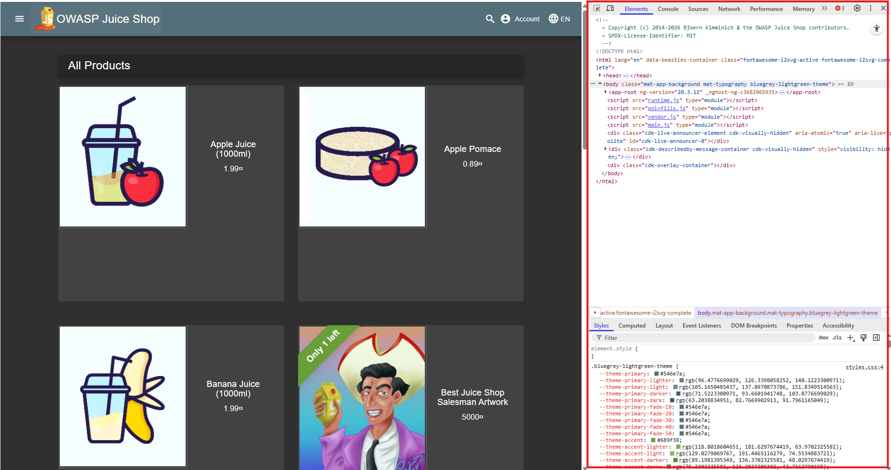
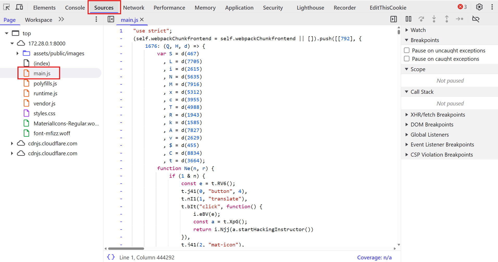
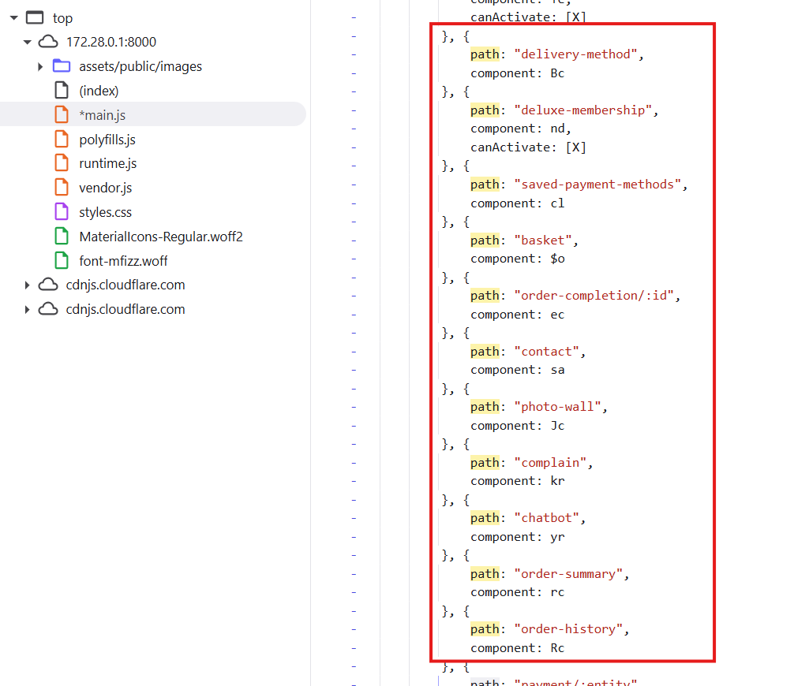
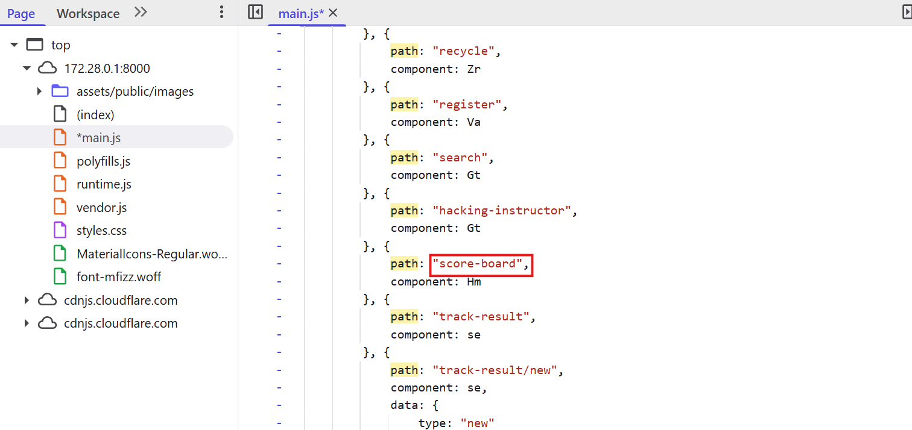
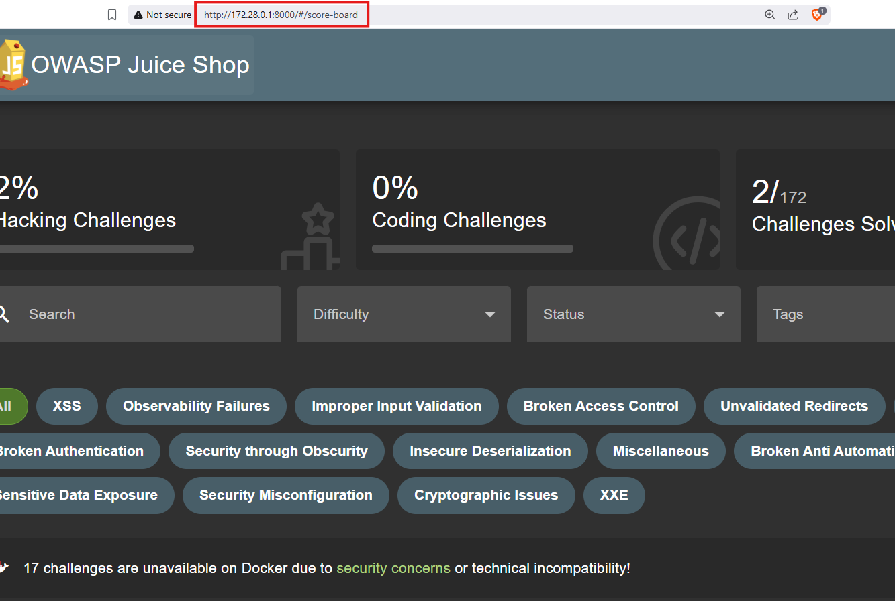
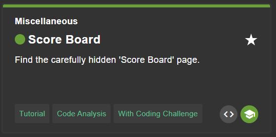

# Score Board

## Why this challenge?
The goal of this challenge is to find and access the hidden "Score Board" page, which is not visible in the navigation menu. This challenge demonstrates that "hiding" a link is not a valid security measure.

## How did I analyze?
* **Observation:** The Juice Shop is a Single Page Application (SPA). This means the website loads a single HTML file and dynamically updates the content as the user interacts with the app.
* **Hypothesis:** In SPAs, the routing logic (defining which URL path leads to which page view) is often handled on the client-side JavaScript. If I can analyze the JavaScript code sent to my browser, I might find paths that are not publicly linked in the UI.

## What i did?
### Step 1
- Using Developer Tool (F12) to see the source code of the website.

### Step 2
- Go to the **Sources** tab, then find the file named "main.js".

### Step 3
- Analyze the code carefully, you see many path of the website.

### Step 4
- Find the hidden path `/score-board`.

### Step 5 
- Access it directly via URL: `http://IP:PORT/score-board`

## Completed challenge!

## Why is it vulnerable?
This issue falls under **Security through Obscurity**.
* The developers relied on the fact that the link was not displayed in the menu to prevent users from accessing the page.
* However, the code containing the route definition (`path: "score-board"`) is sent to every user's browser. Therefore, anyone with basic knowledge of DevTools can discover it.

## How to prevent it?
* **Server-Side Access Control:** Never rely solely on UI hiding. The backend API serving the scoreboard data must verify if the user is authenticated and authorized to view it.
* **Lazy Loading (Partial mitigation):** Configure the application to only load the code for administrative/sensitive modules after the user has successfully logged in and proved their privileges.

## What did I learn?
* How routing works in Single Page Applications (Angular/React/Vue).
* The importance of inspecting client-side JavaScript files (`main.js`) during the reconnaissance phase.
* That anything sent to the client-side (browser) is no longer secret.
