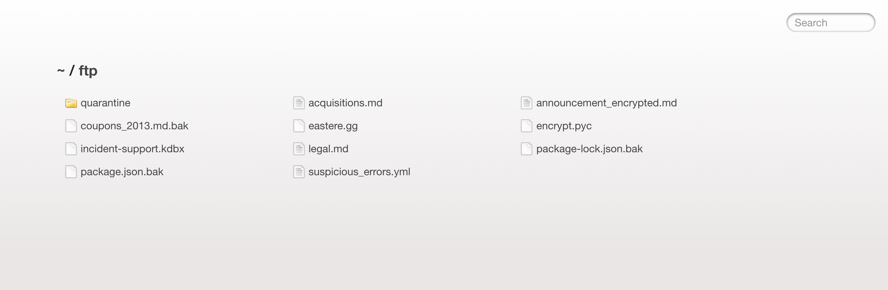
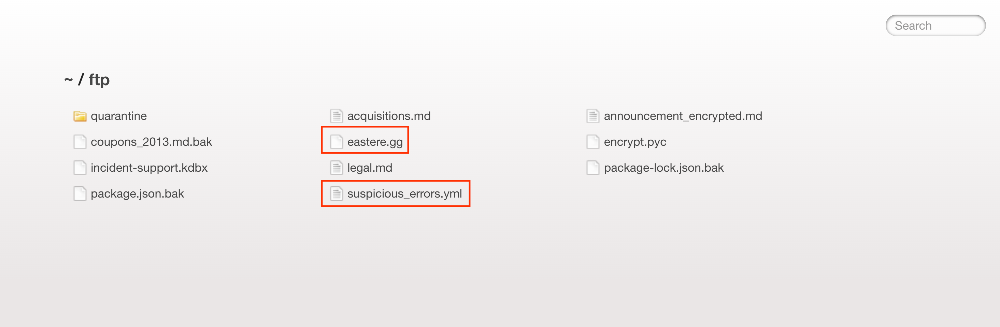
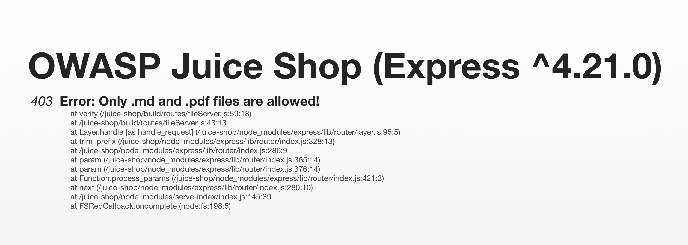

# Error Handling

## Why this challenge?

The goal is to provoke an error on the server that is not gracefully handled. This demonstrates a **Security Misconfiguration** where the application reveals too much information (verbose error messages) when something goes wrong.

## How did I analyze?

- **Observation:** While solving the "Confidential Document" challenge inside the `/ftp` directory, I noticed some files with unusual extensions like `eastere.gg` and `package.json.bak`.
- **Hypothesis:** The web server is configured to serve standard files (like `.md` or `.pdf`), but it might crash or behave unexpectedly if I try to access these weird file types, revealing a stack trace.

## What did I do?

### Step 1

I navigated to the `/ftp` directory (where I previously found the confidential documents).

### Step 2

I attempted to open a file named `eastere.gg` (or any `.pyc` file) by clicking on it.

### Step 3

The application crashed and returned a full stack trace instead of a friendly "404 Not Found" or "403 Forbidden" page.

## Why is it vulnerable?

- **Verbose Error Messages:** The application is likely running in "Development" or "Debug" mode. In this mode, when an error occurs, the server prints the full technical details (Stack Trace) to the browser.
- **Information Leakage:** This stack trace reveals sensitive internal details to attackers, such as:
  - Server paths (e.g., `/juice-shop/routes/fileServer.js`).
  - Modules and libraries being used.
  - The exact line of code that failed.

## How to prevent it?

- **Disable Debug Mode:** Ensure the application runs in "Production" mode where detailed error reporting is turned off.
- **Generic Error Pages:** Configure the server to show a generic, user-friendly message (e.g., "Oops, something went wrong") to the user, while logging the actual technical error internally for developers to check later.

## What did I learn?

- **Fuzzing works:** Trying to access unexpected or broken inputs (like weird file extensions) is a good way to find misconfigurations.
- **Production vs. Development:** Never leave debug configurations active on a live public website.
