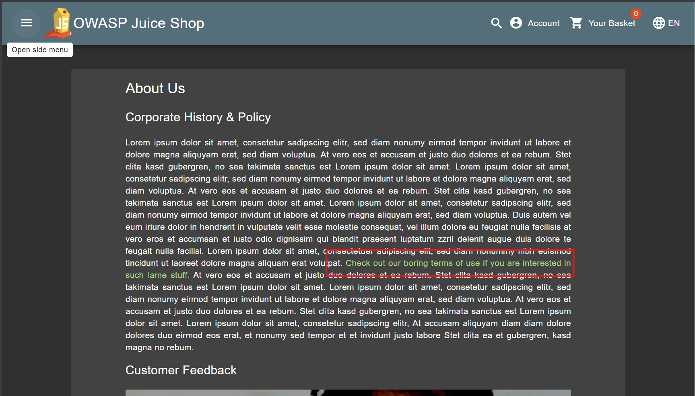
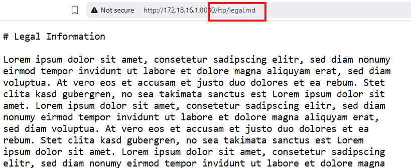
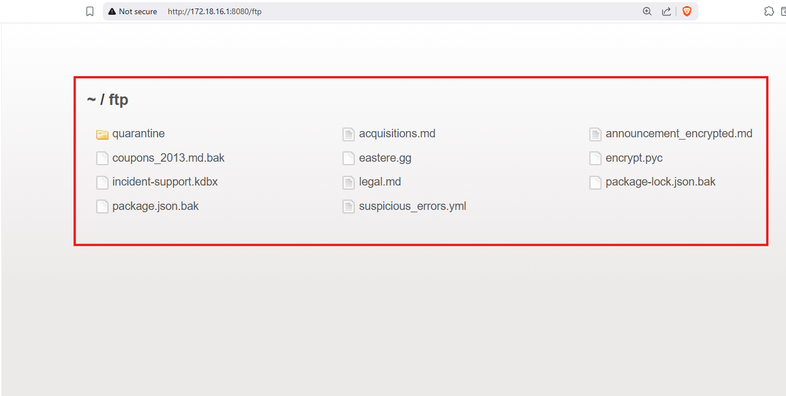
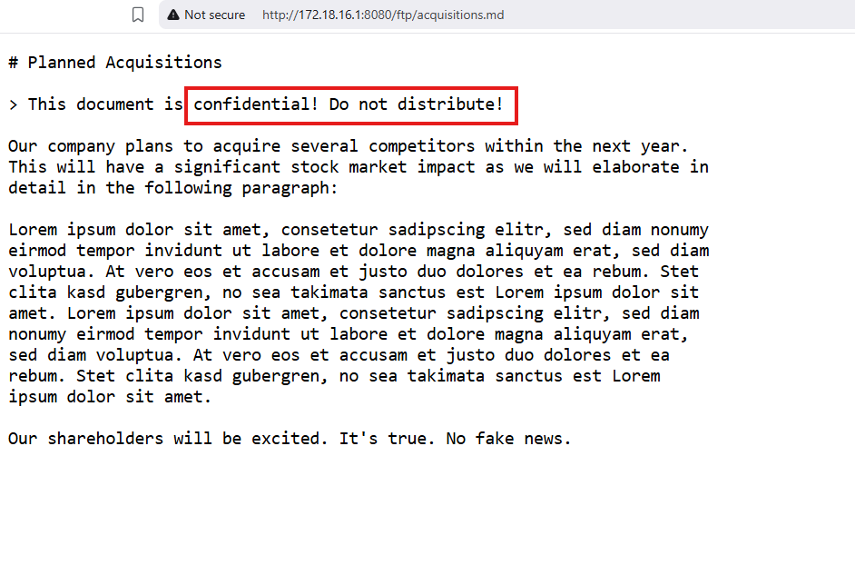
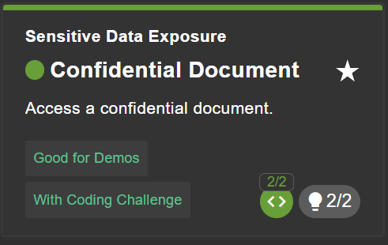

# Confidential Document

## Why this challenge?

## How did I analyze?
* **Observation:** While exploring the "About Us" page, I clicked on a link to the "Terms of Use" (or similar legal documents). I noticed the URL pointed to a file storage path: `/ftp/legal.md`.
* **Hypothesis:** The `/ftp/` directory might contain other files. If the server has **Directory Listing** enabled (a misconfiguration), removing the filename `legal.md` from the URL might reveal all files inside that folder.

## What i did?
### Step 1
- Look around the website for any clues, find the link that leads to the file directory.

### Step 2
- Access the link, and analyze the path.

### Step 3
- Delete the last part of the path, and go to the parent directory.

### Step 4
- Look for any confidential document, that illegally exposed to public.

## Completed challenge!

## Why is it vulnerable?
* **Directory Listing Enabled:** The web server is configured to list all files in a directory if no default index file (like `index.html`) is present.
* **Sensitive Data in Public Folder:** Confidential documents (`acquisitions.md`) were placed in a publicly accessible folder (`/ftp`) without any authentication requirements.

## How to prevent it?
* **Disable Directory Listing:** Configure the web server (Nginx, Apache, etc.) to return a 403 Forbidden error when users try to access a directory path directly.
* **Access Control:** Move sensitive files outside the web root or require a valid login session to download them.

## What did I learn?
* Always check URL paths for directory structures (like `/ftp/`, `/files/`).
* The risk of leaving "Directory Listing" enabled on web servers.