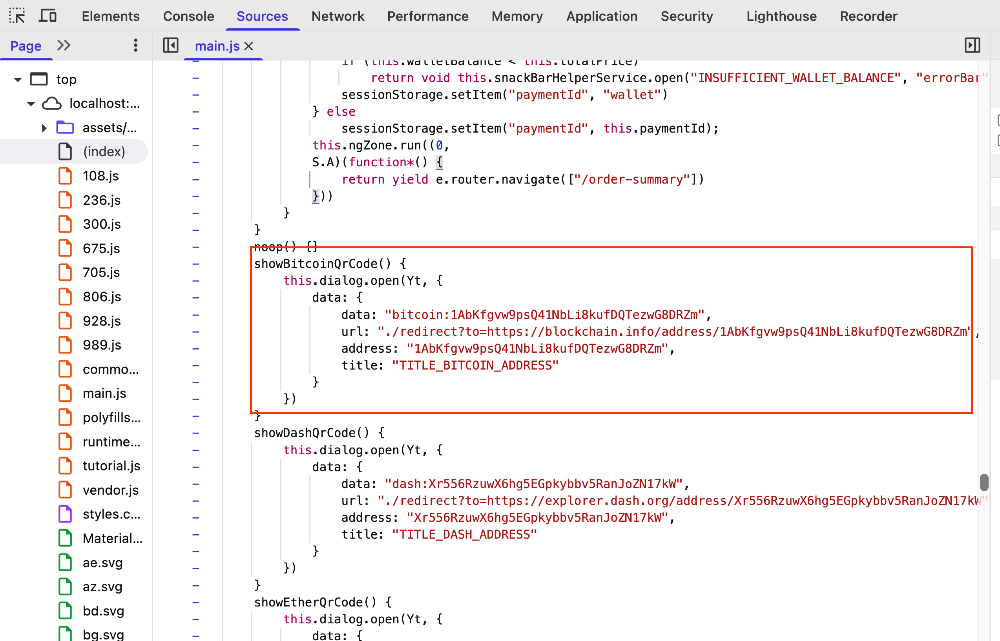
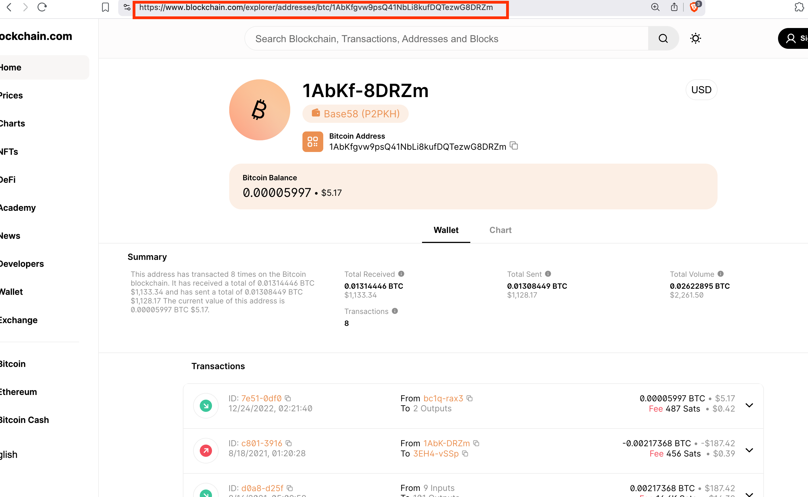
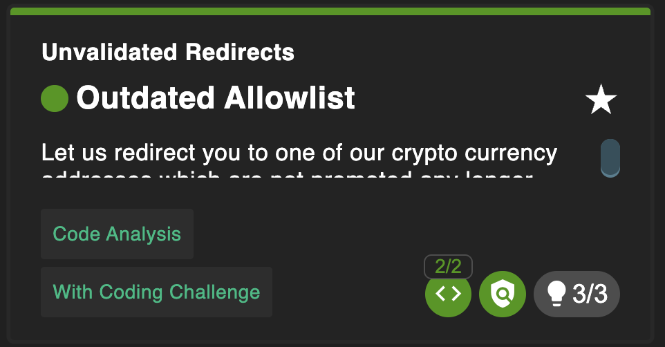

# Outdated Allowlist

## Why this challenge?

The goal is to redirect the user to an unintended cryptocurrency address. This challenge demonstrates an Unvalidated Redirects vulnerability, specifically leveraging an "allowlist" (whitelist) of approved URLs that has not been properly maintained or validated.

## How did I analyze?

* Observation: The application has a feature to "Bitcoin QR Code" which redirects users to a blockchain explorer. The URL looks like this: /redirect?to=https://blockchain.info/address/....

* Hypothesis: The application likely checks the two parameter against a list of allowed URLs (an allowlist) before redirecting. If I can find an address that is "technically" on the list but behaves differently (or a flaw in the list matching logic), I might be able to redirect to a different page.

* Code Review: I inspected main.js and found the showBitcoinQrCode() function. It hardcodes a redirect to https://blockchain.info/address/....

## What I did?

### Step 1
URL Manipulation: Modified the redirect URL parameter to point to a new address that was on the allowlist.

### Step 2

I accessed the modified URL:
http://[IP]:[PORT]/redirect?to=https://blockchain.info/address/1AbKfgvw9psQ41NbLi8kufDQTezwG8DRZm
The application accepted this URL and redirected me, solving the challenge.

### Completed challenge!

## Why is it vulnerable?

* Incomplete Validation: The "allowlist" mechanism was likely checking for specific keywords or partial matches (like blockchain.info) but failed to account for all variations or updates in the external service's URL structure.

* Outdated Logic: The allowed list of URLs was not updated to reflect strict, exact matches, allowing attackers to slip in other URLs that "look" correct to the filter but lead elsewhere.

## How to prevent it?

* Strict Allowlisting: Use an exact-match whitelist for redirect destinations. Do not use regex or partial string matching unless absolutely necessary and rigorously tested.

* Avoid User-Controlled Redirects: If possible, avoid passing the target URL as a parameter (?to=...). Instead, use server-side mapping (e.g., ?id=bitcoin maps to the URL on the server).

* Regular Updates: Periodically review and update the allowlist to ensure it only contains currently valid and safe destinations.

## What did I learn?

* Allowlists are hard: Implementing a secure allowlist is difficult. Partial matches (like "contains https://www.google.com/search?q=google.com") can often be bypassed (e.g., evil-google.com).

* Parameter Tampering: Always test redirect parameters to see if the validation logic has holes.