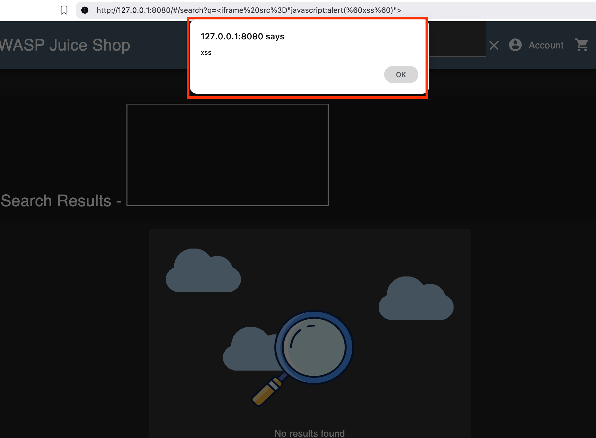
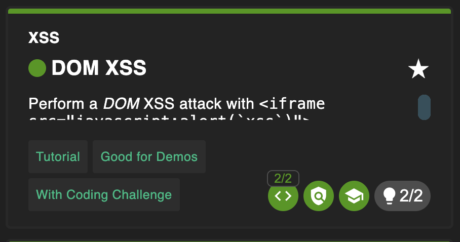

# DOM XSS

## Why this challenge?

The goal of this challenge is to perform a DOM-based Cross-Site Scripting (XSS) attack. It demonstrates how malicious JavaScript can be executed in the victim's browser by manipulating the Document Object Model (DOM) through an unfiltered input field, specifically targeting an `iframe` source attribute.

## How did I analyze?


- **Observation:** The application has a search functionality where the input is reflected on the page. I noticed that the search parameter `q` in the URL directly affects the page content.
- **Hypothesis:** If the application takes the `q` parameter from the URL (Source) and inserts it directly into the HTML (Sink) without proper sanitization, it might be possible to inject malicious HTML tags.
- **Target:** I identified the search function as the injection point and decided to try injecting an `iframe` to execute JavaScript.

## What did I do?

### Step 1

The application's search functionality was identified as a possible vector for XSS attacks. The search parameter `q` in the URL was used to manipulate the DOM.

### Step 2

I crafted an XSS payload using an `iframe`. Unlike a simple `<script>` tag which might be blocked by some frameworks, an `iframe` with a `javascript:` pseudo-protocol in the `src` attribute is often effective.

### Step 3

I crafted the specific XSS payload.
Payload:

**Payload:**

```html
<iframe src="javascript:alert(`xss`)"></iframe>
```

I then URL-encoded this payload and injected it into the search parameter q.
Full Injection URL:
`http://[IP:PORT]/#/search?q=%3Ciframe%20src=%22javascript:alert(%60xss%60)%22%3E`

### Step 4

I navigated to the manipulated URL. The application read the search query from the URL and rendered the iframe tag into the page's HTML. The browser immediately executed the JavaScript code inside the src attribute.

An alert box appeared on the screen with the text "xss". The challenge was marked as solved instantly.


## Complete challenge!



## Why is it vulnerable?

- Unsafe Sink: The application takes user input from the URL (the Source) and passes it directly to a dangerous DOM execution sink (likely innerHTML) without proper validation.

- No Sanitization: The input field allows raw HTML tags, such as the iframe tag, to be rendered. This enables the execution of arbitrary JavaScript code in the user's browser.

## How to prevent it?

- Sanitize Input: Apply rigorous input validation and sanitization on both the client-side and server-side. Use trusted libraries like DOMPurify to strip out malicious tags and attributes before rendering HTML.

- Use Secure Frameworks: Modern frameworks like Angular, React, and Vue have built-in XSS protection. Ensure these features are enabled and avoid using dangerous methods that bypass them (e.g., avoid `dangerouslySetInnerHTML` in React or `bypassSecurityTrustHtml` in Angular unless absolutely necessary and sanitized).

- Content Security Policy (CSP): Implement CSP headers to restrict the sources from which scripts can be loaded or executed. This can significantly mitigate the impact of XSS attacks.

## What did I learn?

- DOM-based XSS: I learned that XSS attacks can occur entirely within the victim's browser (Client-side) without the malicious payload ever being sent to or stored on the server.

- Bypassing Filters: I learned that when standard `<script>` tags are filtered or fail to execute, alternative tags like `iframe` or `img` (with onerror events) can be used as effective vectors.

- Source and Sink: I understood the importance of tracing data flow from the Source (where input enters) to the Sink (where it is executed) to identify vulnerabilities.
